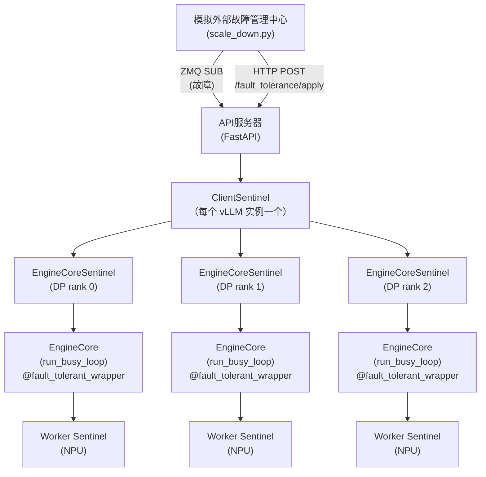
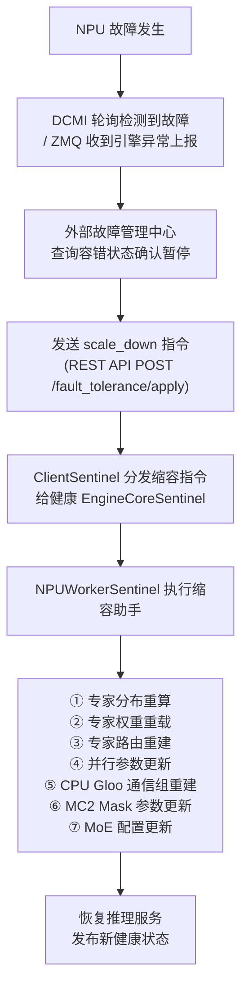
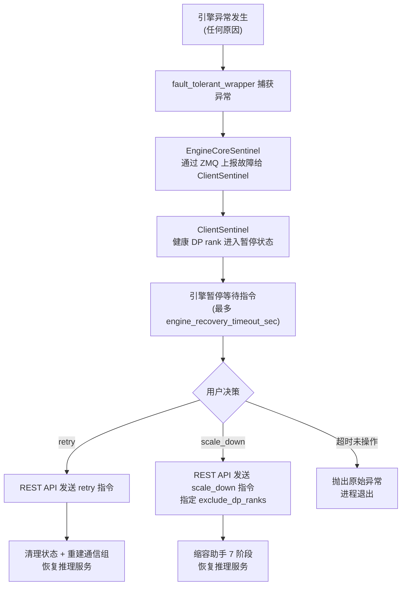
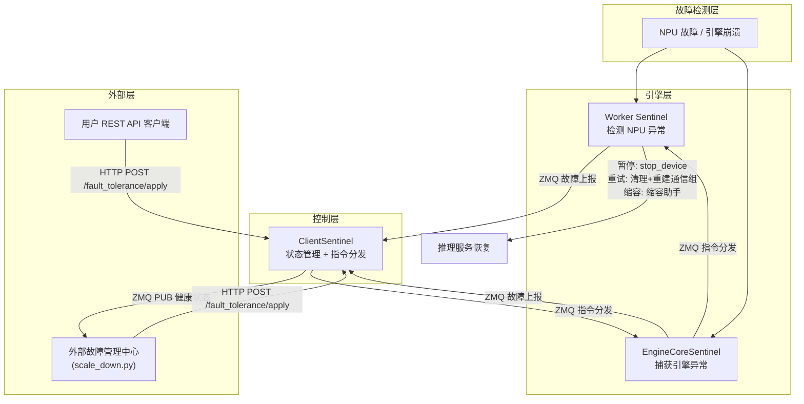

# Elastic EP 设计文档 (DESIGN)

> 本文档描述 Elastic EP 的架构设计、模块设计、容错工作流设计。
> 规格与需求见 [SPEC.md](SPEC.md)。

---

## 1. 架构设计

### 1.1 分层架构



### 1.2 哨兵层级架构

容错框架采用**三级哨兵架构**：

#### 1.2.1 ClientSentinel（顶层）

- 每个 vLLM 实例一个，运行在 API 服务器进程中
- 通过 ZMQ ROUTER 接收所有 EngineCoreSentinel 的故障报告（故障报告含哨兵标识符、进程ID、DP rank id、错误类型、错误追踪堆栈等信息）
- 接收 EngineCore 启动时的哨兵注册请求（注册消息，含哨兵标识符、进程ID、DP rank id、心跳次数）
- 向外部系统发布引擎健康状态（ZMQ 发布，健康状态消息）
- 向引擎分发容错指令（暂停/重试/缩容）
- 处理外部 REST API 请求（`/fault_tolerance/apply`, `/fault_tolerance/status`）

#### 1.2.2 EngineCoreSentinel（中间层）

- 每个数据并行 Rank 一个EngineCoreSentinel，运行在 EngineCore 进程中
- 通过故障信号队列监控引擎异常
- 通过 ZMQ 将故障信息转发给 ClientSentinel
- 接收并执行 ClientSentinel 的指令（暂停/重试/缩容）
- 与 WorkerSentinels 通信，执行工作进程级操作
- 执行重试清理流程（状态重置、Gloo 通信组重建）

#### 1.2.3 NPUWorkerSentinel（底层）

- 每个工作进程（NPU 设备）一个，运行在工作进程中
- 通过 ZMQ 接收 EngineCoreSentinel 的命令
- 在 NPU 级别执行暂停/重试/缩容操作
- 在缩容中执行专家分布重算、专家权重重载、专家路由重建、并行参数更新、CPU Gloo通信组重建、MC2 Mask参数更新、MoE配置更新等操作

### 1.3 容错工作流

#### 带外部故障管理中心（NPU 硬件故障）



#### 不带外部故障管理中心（手动响应）



### 1.4 数据流



### 1.5 关键设计决策

#### 基于 ZMQ 的通信

所有组件间通信使用 ZMQ 套接字，原因：
- 低延迟和高吞吐量
- 解耦的生产者-消费者模式
- 支持异步操作

#### 有状态健康跟踪

ClientSentinel 维护引擎状态字典，跟踪每个引擎的状态：
- 健康 - 引擎正常运行
- 已暂停 - 引擎暂停，等待指令
- 不健康 - 引擎遇到错误
- 已终止 - 引擎进程已退出

#### 指令工作流模型

ClientSentinel 将暂停/重试/缩容指令作为 ZMQ 消息发送给 EngineCoreSentinel。指令消息格式：
```python
@dataclass
class FaultToleranceInstruction:
    instruction: str          # "pause" | "retry" | "scale_down"
    instruction_id: str       # 全局唯一指令 ID
    params: dict              # 指令参数（timeout, exclude_engine_index 等）
```

EngineCoreSentinel 收到指令后，通过指令处理器分发到对应执行函数：
- 暂停处理器：冻结请求处理
- 重试处理器：清理工作进程状态，重建通信
- 缩容处理器：触发缩容助手 7 阶段工作流：专家分布重算 → 专家权重重载 → 专家路由重建 → 并行参数更新 → CPU Gloo 通信组重建 → MC2 算子 Mask 参数更新 → MoE 专家配置更新

#### 故障上报机制

引擎通过 ZMQ 发送故障报告消息到 ClientSentinel，格式：
```python
@dataclass
class FaultReport:
    sentinel_id: str
    pid: int
    rank: int
    err_type: str             # "engine_crash" | "worker_failure" | "npu_hang"
    err_msg: str
    traceback: str
```

ClientSentinel 记录故障后通过 ZMQ 发布广播健康状态消息给所有外部订阅者。

#### 重试清理机制

针对瞬时性错误（transient error），重试指令执行以下恢复步骤：
1. 清理状态：清除暂停事件，停止设备 + 重启设备重新初始化 NPU 设备，重置进程组重置分发通信组，清理 worker 状态（模型状态、KV 连接器输出、输入批次等）
2. 重建 Gloo 通信组：重新初始化 DP cpu_group
3. 恢复请求处理

#### 优雅降级

当 `engine_recovery_timeout_sec` 超时且未收到指令时，会重新抛出原始异常进行标准错误处理，确保系统可预测地失败，而不是无限期挂起。

---

## 2. 模块详细设计

### 2.1 目录结构

```
elastic-ep/vllm/
├── examples/
│   └── fault_tolerance_scale/
│       ├── serve_qwen.sh              # 启动带容错功能的 vLLM 服务
│       └── scale_down.py              # 模拟外部故障管理中心，双路径检测（DCMI + ZMQ）
├── patches/
│   ├── vllm_scale_down.patch          # vLLM v0.18.0 核心容错框架补丁
│   └── vllm_ascend_scale_down.patch   # vllm-ascend v0.18.0 昇腾特定适配补丁
├── tests/
│   └── v1/
│       └── fault_tolerance/
│           ├── __init__.py
│           ├── test_client_sentinel.py        # ClientSentinel 单元测试
│           ├── test_engine_core_sentinel.py    # EngineCoreSentinel 单元测试
│           └── test_npu_worker_sentinel.py     # NPUWorkerSentinel 单元测试
├── README.md                          # 项目说明
├── SPEC.md                            # 技术规格与需求
├── DESIGN.md                          # 架构与模块设计
├── Release_Notes.md                   # 版本发布记录
└── test_report.md                     # 测试报告
```

### 2.2 模块职责

| 模块 | 职责 |
|------|------|
| ClientSentinel | 故障接收、状态管理、指令分发 |
| EngineCoreSentinel | 引擎异常捕获、故障上报、指令执行 |
| NPUWorkerSentinel | NPU级操作、状态清理、资源重建 |
| scale_down.py | 模拟外部故障管理中心，双路径检测（DCMI + ZMQ） |

### 2.3 通信通道

| 通道 | 协议 | 方向 | 用途 |
|------|------|------|------|
| 引擎故障套接字 | ZMQ DEALER/ROUTER | 引擎 -> ClientSentinel | 报告引擎异常（fault_report 消息） |
| 哨兵注册 | ZMQ DEALER/ROUTER | EngineCore -> ClientSentinel | 启动时注册 sentinel_id/pid/rank 信息 |
| 故障状态 PUB/SUB | ZMQ PUB/SUB | ClientSentinel -> 外部 | 广播引擎健康状态（health_status 消息） |
| 容错请求/结果 | ZMQ DEALER/PUSH | ClientSentinel -> 引擎 | 向EngineCore分发 pause/retry/scale_down 指令 |
| Worker进程命令 | ZMQ ROUTER/DEALER | EngineCore -> Worker | 向Worker下发 pause/retry/scale_down 指令 |
| HTTP API | REST | 外部 -> API 服务器 | 外部容错控制 |


## 3. 模拟外部故障管理中心模块设计

### 3.1 scale_down.py

> 脚本说明与参数详见 [README.md §使用](README.md#使用) 和 [SPEC.md §5.1.4](SPEC.md#514-scale_downpy-脚本参数)。

| 项目 | 说明 |
|------|------|
| 路径 | `examples/fault_tolerance_scale/scale_down.py` |
| 功能 | 模拟外部故障管理中心，双路径检测（DCMI 硬件轮询 + ZMQ 引擎健康订阅） |
| 依赖 | DCMI (`libdcmi.so`), requests, ZMQ |
| 工作方式 | 定时轮询 DCMI 获取 NPU 健康状态，同时通过 ZMQ SUB 订阅引擎健康状态，检测到故障后自动通过 REST API 发送缩容指令（可选） |

### 3.2 serve_qwen.sh

> 脚本说明与参数详见 [README.md §使用](README.md#使用) 和 [SPEC.md §5.1.3](SPEC.md#513-serve_qwensh-脚本参数)。

| 项目 | 说明 |
|------|------|
| 路径 | `examples/fault_tolerance_scale/serve_qwen.sh` |
| 功能 | 启动带容错功能的 vLLM 服务 |

---

## 4. CLI 与使用场景

> 详细的启动命令、使用场景与 REST API 示例详见 [README.md §使用](README.md#使用)。
> REST API 规格详见 [SPEC.md §5.3 REST API](SPEC.md#53-rest-api)。
