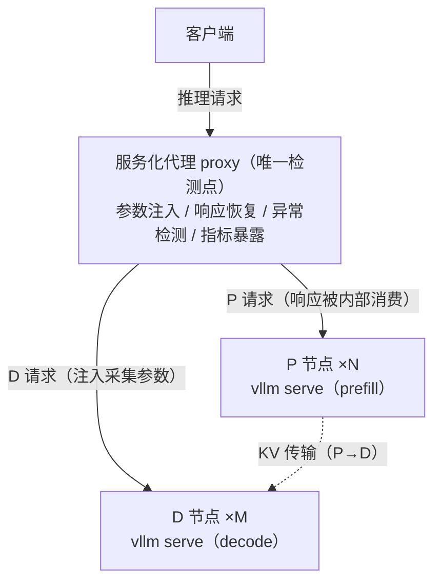

# 推理精度异常检测

## 1 简介

推理精度异常检测基于模型输出的 token 和 logprobs 序列，在无侵入、零参照知识的条件下，实时检测推理过程中可能出现的异常响应，对企业级GenAI推理服务中出现的生僻字、乱码、重复输出等输出崩溃类故障进行在线实时、高准确率的异常检测。

- 生僻字：偶发性输出无意义字符，且不符合上下文语境。
- 乱码：模型持续输出生僻字，明显胡言乱语，文本无意义，无法正常对话。
- 重复：重复输出相同内容。
- NaN Value：logprobs 出现 nan/inf 值

组件核心功能点：

- **透明无侵入检测**：透明拦截推理请求，强制采集 logprobs 与 token_id，后台运行异常
  检测算法，检测全过程对客户端无感知——不影响响应状态、不阻塞响应返回、不泄漏内部参数。
- **Prometheus 指标暴露**：通过独立指标端点（默认 `/anomaly/metrics`）暴露检测结果，
  对接主流监控体系。
- **Web 可视化监控**：独立的 Web 服务，支持多实例聚合可视化异常检测现象，并支持可配置
  的阈值告警与多渠道告警（界面告警 + Webhook（钉钉、飞书、企业微信）+ 邮箱通知），
  详见[章节 4](#4-推理精度异常监控-web-界面)。

组件支持两种部署形态，检测行为保持一致，差异仅在于检测组件的部署位置：

- **单机模式**（[第 2 章](#2-单机部署)）：检测组件以 vLLM `--middleware` 插件形式部署
  在推理服务进程内，随推理服务一同拉起。
- **PD 分离模式**（[第 3 章](#3-pd-分离场景部署)）：Prefill/Decode 分离部署场景下，
  检测组件上移至服务化代理（load_balance_proxy，下称 proxy）集中部署，作为全局唯一
  检测点，P/D 节点零侵入。

## 2 单机部署

### 2.1 安装

```shell
# 进入项目路径
cd accuracy-monitoring/

# 安装包
pip install -e .
```

依赖：`prometheus_client`、`pyyaml`、`numpy`、`httpx`、`colorlog`

### 2.2 部署

在拉起 vLLM 服务的命令中附加精度异常检测中间件 `--middleware anomaly_middleware.AnomalyMiddleware`：

```shell
vllm serve <model> --middleware anomaly_middleware.AnomalyMiddleware
```

请确保当前使用的 vLLM 版本支持 `--middleware` 参数。

### 2.3 可选环境变量

#### 环境变量说明

| 环境变量 | 默认值 | 说明 |
|---|---|---|
| `VLLM_ANOMALY_ENABLED` | `1` | 总开关，`0`/`false` → 纯透传不检测 |
| `VLLM_ANOMALY_MONITOR_RATE` | `1.0` | 请求被异常监控的概率，范围 0.0-1.0，`0` 不检测 |
| `VLLM_ANOMALY_TOP_LOGPROBS` | `20` | 注入的 top-logprobs 数量，范围 1-20 |
| `VLLM_ANOMALY_METRICS_PATH` | `/anomaly/metrics` | 指标端点路径 |
| `VLLM_ANOMALY_TOKENIZER_MODEL` | None | 显式指定模型绝对路径 |
| `VLLM_ANOMALY_SAVE_PATH` | None | 异常详细数据保存到本地，如需开启，请配置保存的路径。默认不开启 |

#### 配置方式

##### (1) 配置示例

以 `VLLM_ANOMALY_TOP_LOGPROBS` 为例，当需要显式设置其取值时，可在拉起服务前配置全局环境变量：

```shell
export VLLM_ANOMALY_TOP_LOGPROBS=10  # 配置 VLLM_ANOMALY_TOP_LOGPROBS 为 10
vllm serve <model> --middleware anomaly_middleware.AnomalyMiddleware
```

##### (2) VLLM_ANOMALY_SAVE_PATH 详细介绍

a) 开启该功能时，请配置存储文件的绝对路径，文件存储为 pkl 格式：

```shell
export VLLM_ANOMALY_SAVE_PATH=/xxx/qwen3.pkl   # 方法1，指定存储的文件
# export VLLM_ANOMALY_SAVE_PATH=/xxx/          # 方法2，指定存储的文件夹，系统默认以模型名作为文件名
vllm serve <model> --middleware anomaly_middleware.AnomalyMiddleware
```

b) 开启该功能后，异常详细信息将保存到本地，便于后续做故障复现。每条异常信息内容如下：

| 字段 | 说明 |
|---|---|
| `time` | 时间戳 |
| `prompt` | 请求 prompt |
| `ill_type` | 异常类型 |
| `topk_logprobs` | topk logprobs |
| `tokens_ids` | topk token ids |
| `text_tokenids` | 推理输出 token ids |
| `text` | 推理输出文本 |
| `model_name` | 模型名称 |

##### (3) VLLM_ANOMALY_MONITOR_RATE 详细介绍

`VLLM_ANOMALY_MONITOR_RATE` 表示请求被异常监控的概率，取值范围 0.0-1.0，有静态和动态两种配置方式。

a) 静态配置：在拉起服务前配置全局环境变量

```shell
export VLLM_ANOMALY_MONITOR_RATE=0.3  # 表示每个请求有 30% 的概率会被监控
vllm serve <model> --middleware anomaly_middleware.AnomalyMiddleware
```

b) 动态配置：当需要根据当前请求量和精度异常检出数量动态调整时，可通过以下接口修改当前请求被异常监控的概率：

```shell
curl -X POST http://${host_ip}:${host_port}/anomaly/config \
  -H "Content-Type: application/json" \
  -d '{"monitor_rate": 0.2}'
```

### 2.4 发送推理请求

```shell
# 发送推理请求（中间件自动拦截注入检测，用户无感知）
curl http://${host_ip}:${host_port}/v1/chat/completions -d '{"model":"...","messages":[...]}'
```

### 2.5 异常指标监控

用户可访问 `anomaly/metrics` 端点查看推理异常检测情况：

```shell
# 查看检测指标，端点：anomaly/metrics
curl http://${host_ip}:${host_port}/anomaly/metrics
```

当前端点已对接[章节 4（推理精度异常监控 Web 界面）](#4-推理精度异常监控-web-界面)，可通过 Web 界面实时监控异常情况。

## 3 PD 分离场景部署

### 3.1 部署架构

PD 分离（Prefill/Decode Disaggregation）将推理过程拆分为两个阶段：P 节点（Prefill）处理输入 prompt、生成 KV 缓存，D 节点（Decode）逐 token 解码、产出输出内容。P 节点与 D 节点分别以 `vllm serve` 命令拉起（配置 KV 传输相关参数），由 vllm-ascend 提供的服务化代理脚本（load_balance_proxy，下称 proxy）统一编排请求转发：所有客户端请求先到达 proxy，经 proxy 调度至 P/D 节点完成推理，D 节点的输出响应流经 proxy 返回客户端。

精度异常检测组件部署在 proxy 所在服务器（proxy 一般部署在通用服务器，P/D 节点部署在计算服务器），集成在请求转发路径上，作为全局唯一检测点：推理请求经 proxy 转发时自动完成采集参数（logprobs、token_id）注入，输出响应流经 proxy 时自动完成响应恢复与检测数据采集，异常检测在 proxy 后台执行，全过程对客户端无感知。



- P 节点仅执行 prefill，其响应由 proxy 内部消费（用于 KV 传输协商），不面向客户端；
- 输出 token 序列全部由 D 节点产生，检测数据抽取自 D 节点响应流。

### 3.2 安装

```shell
# 进入项目路径
cd accuracy-monitoring/

# 安装包
pip install -e .
```

依赖：`prometheus_client`、`pyyaml`、`numpy`、`httpx`、`colorlog`


### 3.3 部署

部署分为两步：先在目标模型所在服务器上离线生成词表类别映射文件，再通过独立启动器拉起带检测功能的 proxy。

#### (1) 离线生成词表类别映射文件

proxy 所在服务器通常没有模型文件，检测所需词表类别映射（token2category）与 token 文本表（token_text）需离线预生成。请将 `tools/gen_token_category.py` 脚本拷贝到目标模型所在服务器执行（该环境需已安装 python 及 transformers 三方库，无需 GPU/NPU，不访问网络）：

```shell
python gen_token_category.py --model-path <模型目录> \
    [--model-name <名称>] [--output-dir <输出目录>]
```

以 Qwen3.5-397B-A17B-w8a8-mtp 模型为例，产物为**同名成对**的两个 JSON 文件：

```text
<output-dir>/
├── token2category/Qwen3.5-397B-A17B-w8a8-mtp_248044.json   # 词表类别映射（检测用）
└── token_text/Qwen3.5-397B-A17B-w8a8-mtp_248044.json       # token 文本表（响应恢复用）
```

请将产物**整体拷贝**回 proxy 所在服务器（如拷贝到 `/home` 下），并保持 `token2category/` 与 `token_text/` 的兄弟目录结构，以便检测组件按同名约定自动定位文本表；若目录结构发生变化，需通过 `--anomaly-token-text` 显式指定文本表路径（见 [3.4 可选环境变量](#34-可选环境变量)）。

#### (2) 拉起带检测功能的 proxy

先拉起 P 节点与 D 节点模型服务，再通过独立启动器运行 proxy 脚本：

```shell
python accuracy-monitoring/tools/run_proxy_with_anomaly.py \
  <load_balance_proxy_server_example.py> \
  --host $host_ip --port $host_port \
  --prefiller-hosts $p_node_ip --prefiller-ports $p_node_port \
  --decoder-hosts $d_node_ip --decoder-ports $d_node_port \
  --anomaly-token2category $token2category_json_path
```

参数说明：

| 参数 | 说明 |
|---|---|
| `<load_balance_proxy_server_example.py>` | vllm-ascend 提供的服务化代理脚本。因 vllm-ascend 版本差异，本项目不随包分发该脚本，可在 vllm-ascend 容器或开源项目 `vllm-ascend/examples/disaggregated_prefill_v1/` 下获取 |
| `--host` / `--port` | proxy 服务监听的 IP 与端口（`$host_ip`/`$host_port`） |
| `--prefiller-hosts` / `--prefiller-ports` | P 节点 IP 与端口（`$p_node_ip`/`$p_node_port`） |
| `--decoder-hosts` / `--decoder-ports` | D 节点 IP 与端口（`$d_node_ip`/`$d_node_port`） |
| `--anomaly-token2category` | 预生成的词表类别映射文件路径（**启用检测时必填**），如 `/home/token2category/Qwen3.5-397B-A17B-w8a8-mtp_248044.json` |


### 3.4 可选环境变量

PD 模式沿用单机部署的全部 `VLLM_ANOMALY_*` 环境变量（含义与默认值见 [2.3 可选环境变量](#23-可选环境变量)），支持以下三种配置方式。

#### (1) 全局环境变量配置

与单机部署一致，在拉起 proxy 前配置全局环境变量：

```shell
export VLLM_ANOMALY_MONITOR_RATE=0.3  # 表示每个请求有 30% 的概率会被监控
# 随后按 3.3 节 (2) 的命令拉起 proxy 即可，命令保持不变
```

#### (2) 启动参数配置

启动器支持 `--anomaly-*` 检测参数，自动映射为对应的 `VLLM_ANOMALY_*` 环境变量（proxy 原参数原样透传）。启动参数与同名环境变量同时配置时，**启动参数优先生效**；未通过启动参数配置的项，回退为已导出的同名环境变量，两者均未配置时使用默认值。

| 检测参数 | 映射环境变量 | 默认值 | 说明 |
|---|---|---|---|
| `--anomaly-token2category <file>` | `VLLM_ANOMALY_TOKEN2CATEGORY` | 无 | 词表类别映射文件，启用检测时必填 |
| `--anomaly-token-text <file>` | `VLLM_ANOMALY_TOKEN_TEXT` | 映射文件兄弟目录 `token_text/` 下同名文件 | token 文本表路径 |
| `--anomaly-monitor-rate <float>` | `VLLM_ANOMALY_MONITOR_RATE` | 1.0 | 请求被异常监控的概率 |
| `--anomaly-workers <int>` | `VLLM_ANOMALY_DETECTOR_WORKERS` | 4 | 检测进程池 worker 数 |
| `--anomaly-save-path <path>` | `VLLM_ANOMALY_SAVE_PATH` | 无 | 异常详细数据落盘路径（建议指定具体 `.pkl` 文件，见下方注意） |
| `--anomaly-enabled` | `VLLM_ANOMALY_ENABLED` | true | 检测总开关（`--no-anomaly-enabled` 等价于 false） |

> 注意：
> - 未配置 `--anomaly-token2category`（或 `--anomaly-enabled false`）时不启用检测，proxy 行为与原版完全一致；
> - 启用检测时，词表类别映射或 token 文本表文件缺失、非法将导致 proxy 启动失败（fail-fast），请务必先完成词表文件生成与拷贝；
> - 配置 `--anomaly-save-path`/`VLLM_ANOMALY_SAVE_PATH` 时，PD 模式下 proxy 不加载模型，启动期无法获取模型名，请以**文件方式指定具体 `.pkl` 文件**（如 `--anomaly-save-path /xxx/qwen3.pkl`）；若指定为文件夹，落盘文件名将无法使用模型名，回退为默认名 `anomalies.pkl`；
> - `VLLM_ANOMALY_TOP_LOGPROBS`、`VLLM_ANOMALY_METRICS_PATH` 等暂无对应的启动参数，仅支持 (1) 中的环境变量方式配置；
> - `VLLM_ANOMALY_TOKENIZER_MODEL` 在 PD 模式下不再使用——proxy 不加载 tokenizer，检测所需词表类别映射与 token 文本表改由离线预生成文件提供。

#### (3) 动态配置监控概率

与单机部署一致（见 [2.3 可选环境变量](#23-可选环境变量) 之 (3)），PD 模式同样支持在服务运行期间通过配置端点动态修改请求被异常监控的概率：

```shell
curl -X POST http://${host_ip}:${host_port}/anomaly/config \
  -H "Content-Type: application/json" \
  -d '{"monitor_rate": 0.2}'
```

由于 PD 模式下采样在 proxy 单点执行，该接口**一次调用即全局生效**，无需逐节点配置；重启后回退为启动时配置的初始值。

### 3.5 发送推理请求

```shell
# 发送推理请求（检测组件在 proxy 转发路径自动完成参数注入与响应恢复，用户无感知）
curl http://$host_ip:$host_port/v1/chat/completions -d '{"model":"...","messages":[...]}'
```

### 3.6 异常指标监控

用户可访问 proxy 的 `anomaly/metrics` 端点查看推理异常检测情况：

```shell
# 查看检测指标，端点：anomaly/metrics
curl http://$host_ip:$host_port/anomaly/metrics
```

当前端点已对接[章节 4（推理精度异常监控 Web 界面）](#4-推理精度异常监控-web-界面)，可通过 Web 界面实时查看监控情况。

## 4 推理精度异常监控 Web 界面

[Web 推理精度异常监控](./webui_README.md)：独立的 Web 服务，支持多 vLLM 实例聚合可视化推理精度异常检测现象，并支持可配置的阈值告警和多渠道告警（界面告警 + Webhook（钉钉、飞书、企业微信）+ 邮箱通知）。

## 5 检测算法阈值配置

检测器算法默认参数在 `configs/detector.yaml`，包含窗口大小、各类异常阈值等，用户可根据需要进行配置：

```yaml
window_size: 128    # 检测窗口大小
stride: 64          # 滑窗步长

rare_character:     # 生僻字检测
  explogp_sum_thresh: 0.4
  category_thresh: 2
  top1_logp_thresh: -6

garbled:            # 乱码检测
  top1_logp_thresh: -5
  window_ratio: 0.2
  window_thresh: 0

repetition:         # 重复检测
  trajectory:
    n: 3
    distinct_n_thresh: 0.2
    logp_thresh: -0.2
  acf:
    acf_threshold: 0.65
    logp_thresh: -0.2
  single_window_thresh: 14
  multi_window_thresh: 2
```

## 6 Prometheus 指标

访问 `GET /anomaly/metrics`（默认路径），Content-Type: `text/plain; version=0.0.4; charset=utf-8`。

| 指标 | 类型 | 标签 | 说明 |
|---|---|---|---|
| `vllm_anomaly_requests_total` | Counter | — | 被检测请求计数 |
| `vllm_anomaly_detected_total` | Counter | `ill_type`, `model` | 检出异常计数 |
| `vllm_anomaly_detection_errors_total` | Counter | — | 检测失败计数 |
| `vllm_anomaly_detection_duration_seconds` | Histogram | — | 检测耗时 |
| `vllm_anomaly_last_rare_character` | Gauge | `model` | 最近生僻字结果（ill_type=1） |
| `vllm_anomaly_last_garbled` | Gauge | `model` | 最近乱码结果（ill_type=2） |
| `vllm_anomaly_last_repetition` | Gauge | `model` | 最近重复结果（ill_type=3） |
| `vllm_anomaly_last_nan_value` | Gauge | `model` | 最近 NaN 结果（ill_type=4） |

`ill_type` 取值：`0`=normal, `1`=rare_character, `2`=garbled, `3`=repetition, `4`=nan_value。
`model` 标签来自请求体 `model` 字段，缺失用 `"unknown"`。
